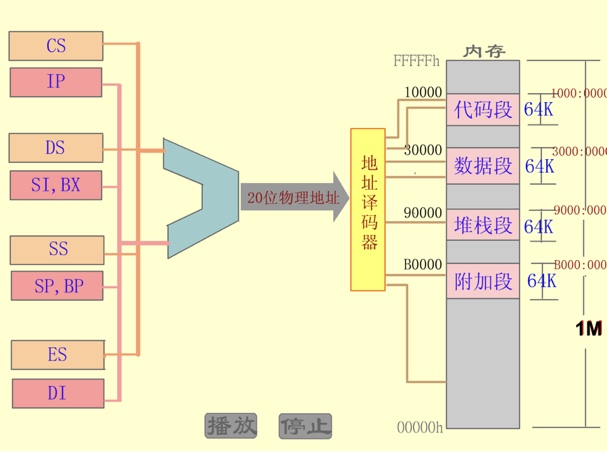
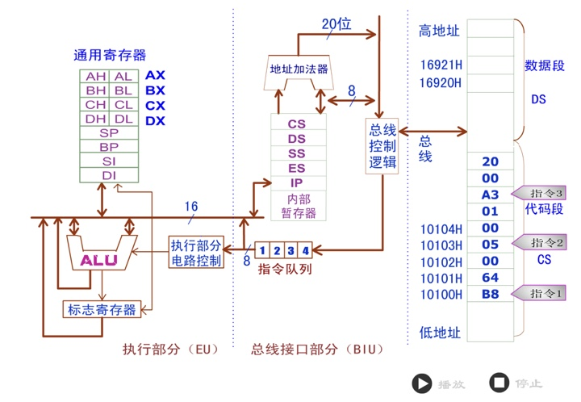
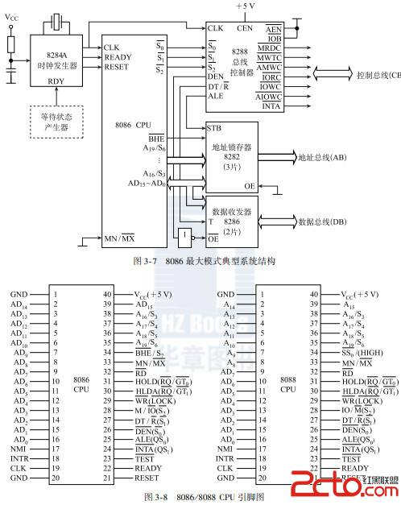
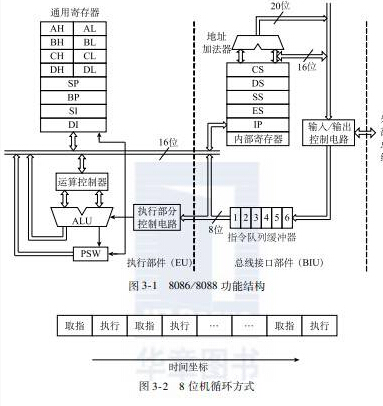
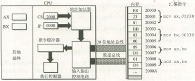

1. 十进制0.1对应二进制是有限小数？有理数还是无理数? 0.2？0.5？
2. 请在C中定义变量年龄age和联系电话tel：
3. ‘0’-9=? ‘a’-’A’=?
4. 在记事本中输入“联通”，保存后再打开是乱码，为什么？怎么解决？
5. 我国是从哪几方面来解决计算机处理汉字的？
6. 矢量字库.ttf和点阵字库.fon各有什么用途？
7. Windows内核采用什么编码？互联网与数据库一般采用什么编码、为什么？

#综述

* 8086有8个8位通用寄存器、8个16位通用寄存器.
* 8086有6个状态标志和3个控制标志.
* 8086将1MB存储空间分段管理，有4个段寄存器，对应4种逻辑段.
* 8086有4个段超越前缀指令，用于明确指定数据所在的逻辑段.





-



16位CPU（8086/8088）
-----------------

地址(arrest)总线：A0~A19 共20根，可访问的内存数为2的20次方（即为1M）。

数据(data)总线：16根，一次可传输16位字节。

内部特性：
-----



### 模块1：总线接口单元BIU，主要负责读取指令和操作数。

* BLU和EU是并行执行的
* 指令和数据都在内存中
* BIU负责取指令和存取操作数
* EU负责译码和指令的执行

###8086CPU

* 执行单元EU 8个通用寄存器:
  **AH,AL**(累加器，使用频度最高，用于算术、逻辑运算以及外设传送信息）
  **BH,BL**（基址寄存器，常用做存放存储器地址；数组首地址。）
  **CH,CL**（计数器，作为循环和串操作等指令中的隐含计数器）
  **DH,DL**.（数据寄存器，常用来存放双字长数据的高16位，或存放外设端口地址。）(对其中某8位的操作，不影响对应8位的操作)

* 1个指令指针寄存器
* 1个标志寄存器
* 4个段寄存器（提醒：永远16位）

###变地址寄存器常用于存储器寻址时提供地址

* SI是源变址寄存器
* DI是目的变址寄存器

###串操作类指令中，SI和DI具有特别的功能

* **串操作指令**:在内存一个存储区域连续存放着若干个字节（或字）数据，这样一组数据称为“数据串”（高级语言视为数组）。若每个数据是一个字节，称“字节串”；若是字，则称“字串”。串操作指令可以用来实现内存区域的数据串操作。
* 源数据串在数据段，以寄存器SI作为地址指针。
* 目的数据串在附加段，以寄存器DI作为地址指针。
* 每次操作后，地址指针SI、DI自动修改，修改的方向取决于方向标志DF。

###指针寄存器

* 指针寄存器用于寻址内存堆栈内的数据
* SP为堆栈指针寄存器，指示栈顶的偏移地址
* SP不能再用于其他目的，具有专用目的
* BP为基值指针寄存器，表示数据在堆栈段中的地址(*可以用于快速寻找栈中数据*)
* SP和BP寄存器与SS段寄存器联合使用以确定堆栈段中的存储单元地址。
* EBP与ESP对应BP和SP，E = enhance，用于32位操作系统
* <font color=red>SP为实时的栈顶指针,BP可以存储某个时刻的栈顶指针.</font>

####堆栈

* 堆栈是主存中一个特殊的区域，用于保存程序调用时的返回地址，用于依序保存程序调用时的值参，还用于程序中动态的申请或释放内存。
* 它采用先进后出FILO（First In Last Out）或后进先出LIFO（Last In First Out）的原则进行存取操作，而不是随机存取操作方式。
* 堆栈通常由处理器自动维持。在8086中，由堆栈段寄存器SS和堆栈指针寄存器SP共同指示。SP指向栈顶，BP指向值参的首地址

####指令指针IP和代码段寄存器CS

* 指令指针寄存器IP，指示代码段中指令的偏移地址
* 它与代码段寄存器CS联用
* 任意时刻,设CS中的值为M,IP中内容为N,则在任意时刻,CPU将从M*16+N(即CS:IP)单元开始,从内存中读取一条指令并执行.
* 代码段中的代码在地址中是连续的
* 要想修改CS和IP,不能使用mov,而用jmp等**转移指令**,格式如下

```x86asm
JMP 2AE2:3 ;执行之后 CS=2AE3H IP=0003H
JMP AX ;可以使用合法寄存器中的值,但注意这只改变IP的值.
```



1. CS,IP的内容送入地址加法器,计算出物理地址=2000H*10H+0000H=20000H
2. 地址加法器将物理地址送入输入输出控制电路.
3. 输入输出电路将物理地址送入地址总线.
4. 20000H处存放的B8 23 01 通过数据总线送入CPU
5. 输入输出电路将指令送入指令缓冲器.
6. IP中的值自动增加(当前指令长度为三字节,因此IP+3).
7. 执行控制器执行指令.
8. 重复上述过程

####标志寄存器

* 用于反映指令执行结果或控制指令执行形式
* 8086处理器的各种标志形成了一个16位的标志寄存器FLAGS（程序状态字PSW寄存器）。
* **进位标志CF(carry flag)**：
  * 当运算结果的最高有效位有进位（加法）或借位（减法）时，进位标志置1，即CF = 1；否则CF = 0。
  * 常用于无符号数
* **零标志位ZF**:
  * 若运算结果为0，ZF=0,若溢出,不计入最后的数值中
  * 零ZR（zero，ZF＝1）.
  * 非零NZ（no zero，ZF＝0）
* **符号标志SF**：
  * 运算结果最高位为1，SF=1（不管进位，若进位，按原最高位的那一位取）,有符号数按照符号取,无符号数看最高位D7.
  * 负NG（negative，SF＝1）
  * 正PL（plus，SF＝0）
* **奇偶标志PF**：
  * 取决于最低8位的"1"的个数.
  * 偶校验PE（even parity，PF＝1）。
  * 奇校验PO（odd parity，PF＝0）
* **溢出标志OF(overflow flag)**：
  * 有溢出为1.两同符号数的符号数相加,结果与真实结果的符号相比较,若不相同,则一定溢出.
  * 溢出OV（overflow，OF＝1）.
  * 无溢出NV（no overflow，OF＝0）
  * 常用于有符号数,在溢出时,运算结果已经不正确.
* **辅助进位标识AF**:
  * 运算时D3位（低半字节）有进位或借位时，AF = 1；否则AF = 0。
  * 辅助进位AC（auxiliary carry，AF＝1）
* **方向标志DF**:
  * 用于串操作指令中，控制地址的变化方向
  * 增量UP（direction up，DF＝0）
  * CLD指令复位方向标志：DF＝0
  * STD指令置位方向标志：DF＝1
* **中断允许标志IF**：
  * 用于控制外部可屏蔽中断是否可以被处理器相应，IF=1表示允许中断；CLI指令复位中断标志IF=0，STI置位中断标志IF=1.
  * 允许中断EI（enable interrupt，IF＝1）
  * 禁止中断DI（disable interrupt，IF＝0）
* **陷阱标志TF**：
  * 用于控制处理器进入单步操作方式，TF=0正常工作；（处理器在每条指令执行结束时，便产生一个编号为1的内部中断）
  * 允许中断EI（enable interrupt，IF＝1）

###存储器组织与段寄存器

* 寄存器是微处理器内部暂存数据的存储单元，以名称表示.
* 存储器则是微处理器外部存放程序及其数据的空间
* 程序及其数据可以长久存放在外存，在程序需要时才进入主存
* 主存需要利用地址区别

###数据的地址对齐

* 同一个存储器地址可以是字节单元地址、字单元地址、双字单元地址等等
* 字单元安排在偶地址（xxx0B）、双字单元安排在模4地址（xx00B）等，被称为“地址对齐（Align）”
* 对于不对齐地址的数据，处理器访问时，需要额外的访问存储器时间
* 应该将数据的地址对齐，以取得较高的存取速度.

##存储器的分段管理

> 8086CPU有20条地址线,最大可寻址空间为2^20＝1MB,物理地址范围从00000H～FFFFFH.
> 8086CPU将1MB空间分成许多逻辑段（Segment）,每个段最大限制为64KB,段地址的低4位为0000B.
> 这样，一个存储单元除具有一个唯一的物理地址外，还具有多个逻辑地址.

###物理地址和逻辑地址

* 对应每个物理存储单元都有一个唯一的20位编号，就是物理地址，从00000H～FFFFFH。
* 分段后在用户编程时，采用逻辑地址，形式为 **段基地址 : 段内偏移地址**.
* 段地址说明逻辑段在主存中的起始位置.
* 8086规定段地址必须是模16地址：xxxx0H
* 省略低4位0000B，段地址就可以用16位数据表示，就能用<font color=red>16位段寄存器</font>表达段地址.
* 偏移地址说明主存单元距离段起始位置的偏移量.
* 每段不超过64KB，偏移地址也可用16位数据表示.

##段寄存器

###段值的确定

* 一个执行文件.exe在电击执行时，首先由操作系统分析本程序的段占用情况：包括多少段、各段长度、代码段第一条指令的偏移
* 然后在当前内存中寻找合适区域，并分配CS、DS、SS、ES等各段.
* 把.exe执行文件中的数据调入内存DS段，代码调入内存CS段……..
* 然后把CPU的CS变为当前分配的代码段值，IP为第一条指令的偏移，从而开始程序的执行
* 在汇编程序时，通过交叉文件可以看出各段大小。

###代码段

* 代码段用来存放程序的指令序列.
 * 代码段寄存器CS存放代码段的段地址.
 * 指令指针寄存器IP指示下条指令的偏移地址.
* 处理器利用CS:IP取得下一条要执行的指令.

###堆栈段Stack Segment

* 堆栈段确定堆栈所在的主存区域.
 * 堆栈段寄存器SS存放堆栈段的段地址.
 * 堆栈指针寄存器SP指示堆栈栈顶的偏移地址.
* 处理器利用SS:SP操作堆栈顶的数据.

###数据段Data Segment

* 数据段存放运行程序所用的数据
 * 数据段寄存器DS存放数据段的段地址
 * 各种主存寻址方式（有效地址EA`可以由几部分组成：基址寄存器内容、变址寄存器内容、比例因子和位移量。`）得到存储器中操作数的偏移地址.
* 处理器利用DS:EA存取数据段中的数据
* mov支持将内存地址中的数据送入寄存器,
* 8086不支持将数据直接存入段寄存器中,因此要改变DS的值,必须使用如下代码:

```x86asm
MOV BX,1000H
MOV DS,BX
```

###附加段Extra Segment

* 附加段是附加的数据段，也用于数据的保存.
 * 附加段寄存器ES存放附加段的段地址.
 * 各种主存寻址方式（有效地址EA）得到存储器中操作数的偏移地址.
* 处理器利用ES:EA存取附加段中的数据.
* 串操作指令将附加段作为其目的操作数的存放区域.

###各个逻辑段的分配

* 程序的指令序列必须安排在代码段.
* 程序使用的堆栈一定在堆栈段.
* 程序中的数据默认是安排在数据段，也经常安排在附加段，尤其是串操作的目的区必须是附加段.
* 数据的存放比较灵活，实际上可以存放在任何一种逻辑段中.

###段超越前缀指令

* 没有指明时，一般的数据访问在DS段(为默认)；使用BP访问主存，则在SS段.
* 默认的情况允许改变，需要使用段超越前缀指令；8086指令系统中有4个：CS,DS,SS,ES.

```x86asm
;前两句等价
MOV AX,[2000H]
MOV AX,DS:[2000H]

MOV AX,ES:[2000H]
```

###段寄存器的使用规定

| 访问存储器的方式                 | 默认               | 可超越                   | 偏移地址                   |
| :------------------------------- | ------------------ | ------------------------ | -------------------------- |
| 取指令                           | CS                 | 无                       | IP                         |
| 堆栈操作                         | SS                 | 无                       | SP                         |
| <font color=red>一般数据访问     | <font color=red>DS | <font color=red>CS,ES,SS | <font color=red>有效地址EA |
| <font color=red>BP基址的寻址方式 | <font color=red>SS | <font color=red>CS,ES,SS | <font color=red>有效地址EA |
| 串操作的源操作数                 | DS                 | CS,ES,SS                 | SI                         |
| 串操作的目的操作数               | ES                 | 无                       | DI                         |

###存储器的分段

* 8086对逻辑段**要求**:
 * 段地址低4位均为0(<font color=red>也就是16进制地址的最后一位为0</font>)
 * 每段最大不超过64KB
* 8086对逻辑段并**不要求**：
 * 必须是64KB
 * 各段之间完全分开（即**可以重叠**,如图）


####数据信息的表达单位

