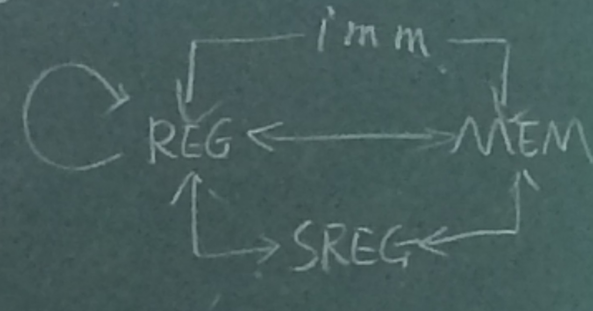

##指令的组成

* 指令由操作码和操作数两部分组成
* 操作码说明计算机要执行哪种操作，如传送、运算、移位、跳转等操作，它是指令中不可缺少的组成部分
* 操作数是指令执行的参与者，即各种操作的对象
* 有些指令不需要操作数，通常的指令都有一个或两个操作数，也有个别指令有3个甚至4个操作数

###指令的操作码和操作数

* **每种指令的操作码**:
 * 用一个唯一的助记符表示（指令功能的英文缩写）
 * 对应着机器指令的一个二进制编码
* **指令中的操作数**：
 * 可以是一个具体的数值
 * 可以是存放数据的寄存器
 * 或指明数据在主存位置的存储器地址

###指令的助记符格式:

> 标号:操作码 dest,src ;注释

##指令系统

###1、数据传送指令

* MOV:传送
* PUSH,POP:堆栈操作
* XCHG:交换
* IN,OUT:输入输出
* XLAT:转换
* LEA,LDS,LES:地址传送
* PUSHF,POPF,LAHF,SAHF:标志传送

###2、算术类指令

* ADD,ADC,AAA,DAA:加法
* INC:加1
* SUB,SBB,AAS,DAS:减法
* DEC:减一
* CMP:比较（减法比较，不会修改被减数，但是会修改符号位等）
* NEG:求补
* MUL,IMUL,AAM:乘法
* DIV,IDIV,AAD:除法
* CBW,CWD:符号扩展

###3、逻辑运算指令

* NOT:求反
* AND:逻辑乘
* OR:逻辑加
* XOR:亦或
* TEST:测试位
* SHL,SHR,SAL

###4、字符串操作

* MOVS,MOVSB/MOVSW ;传送串
* CMPS,CMPSB/CMPSW ;串比较
* SCAS,SCASB/SCASW ;串扫描
* LODS,LODSB/LODSW ;取字符串
* STOS,STOSB/STOSW ;存字符串
  (REP,REPZ,REPNZ: 重复前缀).

###5、控制转移指令

* CALL:子程序调用
* RET:子程序返回
* JMP:无条件转移
* JZ,JNZ,JC,JNC,JO,JNO,JS,JNS,JP,JNP,JA,JAE,JB,JBE,JG,JGE,JL,JLE:条件转移
* LOOP:循环
* LOOPNE,LOOPE:条件循环
* JCXZ:寄存器CX=0转移
* INT,INTO:中断
* IRET:中断返回
* INVOKE

###6、处理机控制指令

* CLC: 清除CF标志
* CMC：进位位CF求反
* STC：置CF标志
* STD：置DF标志
* CLD：清除DF标志
* HLT：处理机暂停
* WAIT：等待状态
* ESC：将数据传送给协处理器（提供到地址/数据线上）
* LOCK：保证总线的控制
* NOP：无操作

补充资料：
=====

```x86asm
;mov
mov DST,SRC ;将SRC的内容传送到DST中。
;DST可用:REG MEM SREG
;DST不可用:IP,IO,IMM
```

* REG
 * IMM,REG,MEM,SREG
* MEM
 * IMM,REG,SREG
* SREG
 * REG,RAM



```x86asm
;push 和 pop
;设置ss段寄存器地址和sp堆栈指针寄存器地址，为10010H
mov AX,1000H
mov ss,ax
mov sp,0010H
;执行压栈操作
mov ax,ff11H
push ax ;执行sp=sp-2,再把ax放入放入sp(1000EH)中,其中ff放在1000FH中，11放在1000EH中，为“高高低低”原则。
;执行出栈操作
pop bx ;先把SS:SP中的数据送入bx中，再将SP=SP+2。此时SS:SP中数不变，但是已经不在栈中。
```

```x86asm
;XCHG
XCHG CH,AL ;寄存器之间相互交换
;REG,REG/MEM
;MEM,REG
```

####IN 和 OUT

*端口读写指令*

* 端口是主机与外设交换数据使用的，分为数据端口，状态端口和控制端口。
* PC给每个端口分配了地址，呈线性排列，形成一个独立于内存空间的IO地址空间，范围为0000H-FFFFH

```x86asm
IN AL,21H ;表示从21H端口读取一字节数据到AL
IN AH,21H ;表示从21H读取一字节数据到AL,从22H读取1字节到AH
;立即数要小于256

MOV DX,379H
IN AL,DX ;从端口379H读取1字节到AL

OUT 21H,AL ;将AL的值写入21H端口
OUT 21H,AX ;将AX的值写入端口地址21H开始的连续两个字节。
```

####XLAT:转换编码

* 将地址DS:[BX数据表偏移地址+AL]的一字节内容传送到AL.

```x86asm
MOV BX,TABLE
MOV AL,4
XLAT
```

####LEA:取有效地址

* 取有效地址也就是取偏移地址
* LEA 指令要求原操作数必须是存储单元，而且目的操作数必须是一个除段寄存器之外的16位或32位寄存器。
* 因该寄存器常用来作为地址指针，故在此最好选用四个间址寄存器BX,BP,SI,DI之一。

```x86asm
;以下两句话等价,其中第一个执行较快
MOV BX,OFFSET TABLE ;立即数寻址
LEA BX,TABLE
```

####LDS:

####ADD:

```x86asm
mov ax,7ff0h
add al,10h ;ax=7f00h,cf=1,of=0,pf=1,sf=0,zf=1,af=0
add ah,1 ;ax=8000h,cf=0;of=1,pf=0,sf=1,zf=0,af=1
add ax,2 ;ax=8002h,cf=0,of=0,pf=0,sf=1,zf=0,af=0
```

#### XCHG

实现dd变量v1,v2交换.

```x86asm
mov eax,v1
xchg eax,v2
mov v1,eax
```

