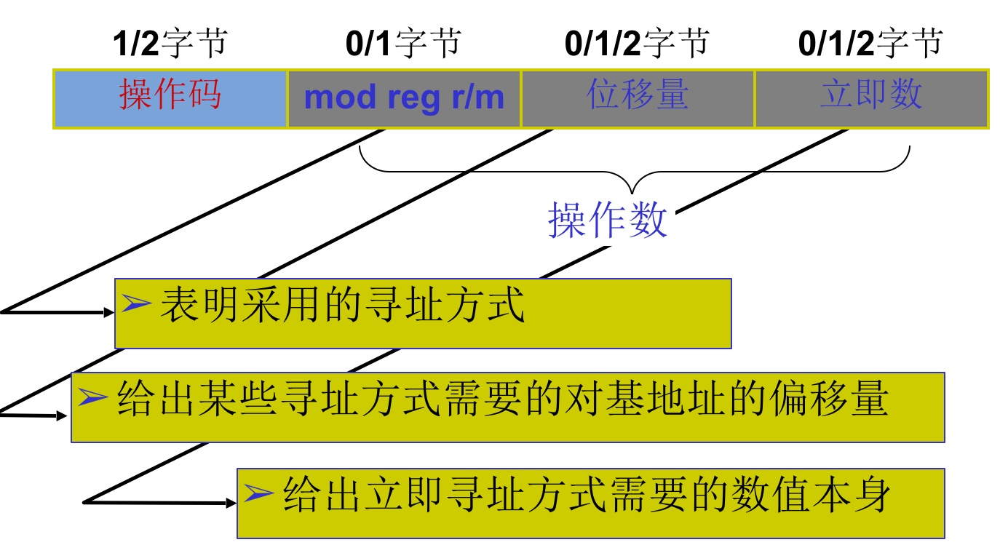

#总共2+5+4=11种寻址方式

##立即数寻址方式

* 指令中的操作数直接存放在机器代码中，紧跟在操作码之后（操作数作为指令的一部分存放在操作码之后的主存单元中）
* 这种操作数被称为立即数imm，它可以是8位数值i8（00H～FFH）也可以是16位数值i16（0000H～FFFFH）
* 立即数寻址方式常用来<font color=red>给寄存器赋值</font>
* **立即数存储于代码中,是指令的一部分**

```x86asm
;EXAMPLE
MOV AL,05H	;AL←05H(8位立即数)
MOV AX,0102H	;AX←0102H(16位立即数)
```

##寄存器寻址方式

* 操作数存放在CPU的内部寄存器reg中，可以是8位寄存器r8,16位r16,32位r32,也可以是段寄存器CS,DS,SS,ES

```x86asm
MOV AX,1234H	;AX←1234H
MOV BX,AX		;BX←AX
```

##存储器寻址方式

* 指令中给出操作数的主存地址信息（偏移地址，称之为有效地址EA），而段地址在默认的或用段超越前缀指定的段寄存器中
* 8086设计了多种寻址方式:
  `1、直接寻址方式
  2、寄存器间接寻址方式
  3、寄存器相对寻址方式[REG+OFFSET]
  4、基址变址寻址方式[基reg+变REG]
  5、相对基址变址寻址方式`
* 操作数在内存寻址可归纳为:

>BX/BP(基址)+SI/DI(变址)+off(偏移地址);
>BX/BP+SI/DI*n(n为比例因子1,2,4,8...)+off 386以上CPU;
>每一部分都是可选的;
>但至少有一部分.

###直接寻址方式

* 有效地址在指令中直接给出
* 默认的段地址在DS段寄存器，可使用段超越前缀改变

```x86asm
MOV AX,[2000H];与下面的等价
MOV AX,DS:[2000H]

MOV AX,ES:[2000H]
```

###存储器间接寻址方式

* 有效地址存放在基址寄存器BX或变址寄存器SI、DI中,不是BP(因为它表示数据在堆栈段的地址).
* 默认的段地址在DS段寄存器，可使用段超越前缀改变.

```x86asm
MOV AX,[SI];与下面的等价
MOV AX,DS:[SI]
```

###存储器相对寻址方式

* 有效地址是寄存器内容与有符号8位或16位位移量之和，寄存器可以是BX、BP或SI、DI.

>有效地址＝BX/BP/SI/DI＋8/16位位移量.

* 段地址对应BX/SI/DI寄存器默认是DS，对应BP寄存器默认是SS；可用段超越前缀改变

```x86asm
MOV AX,[DI+06H];与下面的等价
MOV AX,DS:[DI+06H]

MOV AX,[BP+06H];与下面的等价
MOV AX,SS:[BP+06H]

MOV AX,[BP];与下面的等价
MOV AX,SS:[BP+00H]
```

###基址变址寻址方式

* 有效地址由基址寄存器（BX或BP）的内容加上变址寄存器（SI或DI）的内容构成：

>有效地址＝BX/BP＋SI/DI

* 段地址对应BX基址寄存器默认是DS，对应BP基址寄存器默认是SS；可用段超越前缀改变.

```x86asm
MOV AX,[BX+SI];与下面的等价
MOV AX,DS:[BX+SI]

MOV AX,[BP+DI];与下面的等价
MOV AX,SS:[BP+DI]

MOV AX,DS:[BP+DI];需要修改必须标明段寄存器
```

###相对基址变址寻址方式

* 有效地址是基址寄存器（BX/BP）、变址寄存器（SI/DI）与一个8位或16位位移量之和：

>有效地址＝BX/BP＋SI/DI＋8/16位位移量

* 段地址对应BX基址寄存器默认是DS，对应BP基址寄存器默认是SS；可用段超越前缀改变
* 注意：BX+SI+n后的值可能没意义，超出你所要求的范围。只能是0000~FFFF。
* 位移量可以用符号(事先定义的变量或常量)表示.

```x86asm
MOV AX,[BX+SI+06H];与下面的等价
MOV AX,DS:[BX+SI+06H]
```

##比例寻址方式

* **386以上**的CPU支持比例寻址方式
* 支持32、64位的寄存器与存储器
* 基址与变址寄存器任意、变址不能为SP

>1、[ 变址寄存器*n 比例因子]
>2、[ 变址寄存器*n + 偏移地址offset ]
>3、[ 基址寄存器 + 变址寄存器*n ]
>4、[ 基址寄存器 + 变址寄存器*n + 偏移地址offset  ]

##8086机器码格式



###指令操作数的表达---寄存器

* r8——任意一个8位通用寄存器

>AH AL  BH BL  CH CL  DH DL

* r16——任意一个16位通用寄存器

>AX BX CX DX   SI DI BP SP

* reg——代表r8或r16
* seg——段寄存器

 >CS/DS/ES/SS

* m8——一个8位存储器操作数单元（所有主存寻址方式）
* m16——一个16位存储器操作数单元（所有主存寻址方式）
* mem——代表m8或m16
* i8——一个8位立即数
* i16——一个16位立即数
* imm——代表i8或i16
* dest——目的操作数
* src——源操作数

###变量访问

* 普通变量[数据段的偏移]
* 结构成员[结构首地址+成员变量的偏移]
* 数组变量[数组首地址+元素下标*n]
* 结构中的数组[结构首地址+元素下标*n+成员变量的偏移]
* 堆栈中的数据访问[EBP±n]
* 堆栈中的数组访问[EBP+ESI*n±n]
