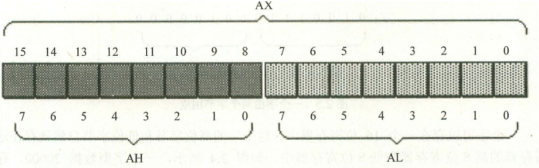
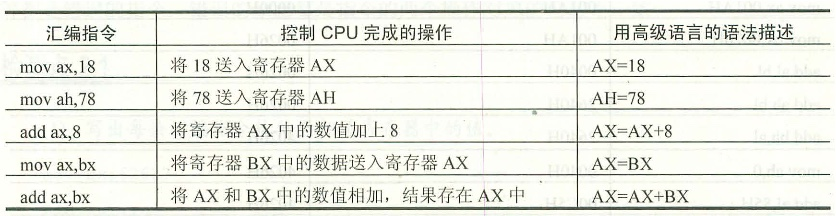
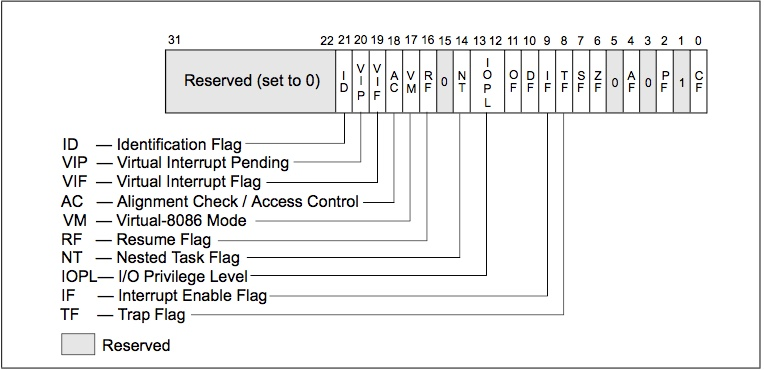
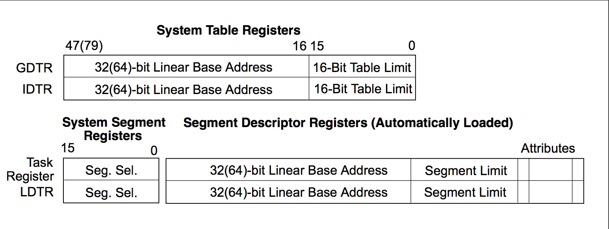
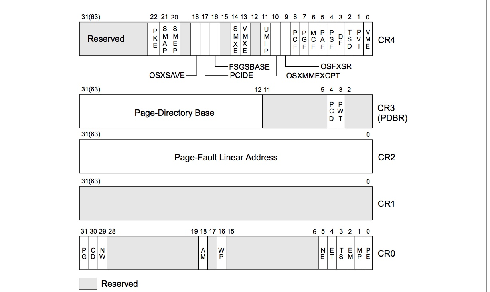

2.1 通用寄存器
=========

在8086CPU中，通用寄存器为AX,BX,CX,CX四个。

他们可分为两个独立的8为寄存器使用。AX→AH（高8位）和AL（低8位）。

2.2 字在寄存器中的存储
=============

字节：记为byte,一个字节由8bit组成

字：word，一个字由两个字节组成。

2.3 几条汇编指令
==========

指令不区分大小写，

###4.1.1标志寄存器EFLAGS
* **TF(bit8)** 置1启动单步执行,置0禁止;单步执行时处理器在执行每个指令后生成调试异常.
* **IF(bit9)** 置1响应可屏蔽中断;置0屏蔽可屏蔽中断;
* **I/O privilege level field(bit12-13)** IPOL指明当前运行程序或任务的IO特权等级,在等级为0时可以使用POPF或IRET修改.
* **Nested Task(bit14)** 嵌套任务标志,控制被中断任务合调用任务之间的关系,使用 _CALL_ , 中断 ,异常时,处理器会置1.IRET,POPF/POPFD指令会修改标志.
* **Resume(bit16)** RF用于控制处理器对断点指令的相应.置1禁止断点指令产生调试异常.当调试软件使用IRETD指令返回被中断的程序之前,需要设置对战上ELAGS内容的RF标志,防止指令断点造成另一个异常.
* **VM(bit17)** 置1开启虚拟8086方式.

###4.1.2 内存管理寄存器
* GDTR和IDTR初始化时基地址默认0,limit默认0xFFFF.

#####在实模式下段寄存器存放地址,在保护模式下段寄存器存放选择字,隐藏的缓存器中存储地址.

###控制寄存器CR

#####CR0:包含系统控制标志位
* PG(bit31) 置1时启用分页模式;在PE位置0时PG位无效

#####CR3:包含分页结构基地址和处理器中的分页缓存
* PCD(bit4) 控制进入当前分页结构的第一页的内存类型.
* PWT(bit3) 功能同上.
* Page-Directory Base(bit31-12) 页目录的物理内存基地址,作为一个普通的页存储在物理内存中.在任务切换时CR3会更新为新任务的页目录地址
