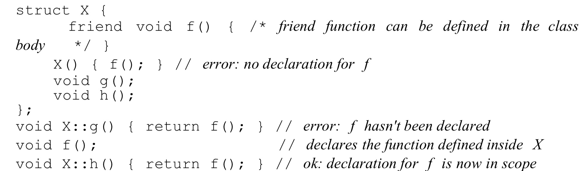

## 7.1 类的基本定义
#### `this`指针
* 指针本身是`const`的
* 指针指向该类的非const版本
#### `const`成员函数
* 对于`const`成员函数，其所在的object是只读的。
* 定义`const`成员函数的方法如下

```C++
std::string isbn() const {
  return this->bookNo;
}
```
* 当object是`const`的时候，只能调用const成员函数。
#### 类的作用域和成员函数
* 编译器处理类时，会先处理成员变量和成员函数的声明；之后再处理成员函数体内部的内容。因此成员的定义顺序对结果无任何影响。

#### 7.1.3 定义非成员函数
对于一些用于辅助的函数，例如`add`,`read`等，虽然它们概念上是类的接口，但它们不是类的一部分。

这些函数一般与类定义在同一个头文件中。
`read`函数如下：
``` C++
// input transactions contain ISBN, number of copies sold, and sales price 
istream &read(istream &is, Sales_data &item)
{
  double price = 0;
  is >> item.bookNo >> item.units_sold >> price; 
  item.revenue = price * item.units_sold;
} 
```
> 注意：使用IO流进行读写之后会改变IO流对象，因此函数定义的时候IO流不能为`const`类型。

### 7.1.4构造函数概述
* 当定义一个`const`类型的类时，在构造器初始化阶段它不是`const`的，只有在完成时才是。
* 有的类不能依靠默认构造器。如果类中有复杂类型或指针，在初始化时会生成未定义的值
* 只有在一个类没有定义构造器的时候，编译器才会生成一个默认的构造器

* 定义默认函数，默认函数不能有参数。
```
Sales_data() = default;
```
#### 构造器初始化列表 (constructor initializer list)
冒号和大括号之间的部分就是构造器初始化列表，列表内部是每个成员变量的初始化值，不同变量用逗号隔开。
``` C++
Sales_data(const std::string &s): bookNo(s) { }

Sales_data(const std::string &s, unsigned n, double p): 
  bookNo(s), units_sold(n), revenue(p*n) { }
```

### 7.1.5 Copy, Assignment, and Destruction
类控制着自身的 复制, 赋值, 析构.
* 如果我们不自己定义这些操作,编译器就会自行生成一个.
  * 通常情况下编译器自己生成的函数就是把所有成员分别进行 复制/赋值/析构.
  
* 在有些时候自动生成的函数不起作用, 例如: 一个类内部包含有动态内存管理.
* 对于成员变量是`Vector`或者 `string`的, 编译器自动生成的函数会正确处理这些对象.

## 7.2 访问控制和封装
`public`和`private`.
* `public` 存储构造函数和接口函数.
* `private` 存储成员变量和内部实现的函数.

定义一个类可以使用`class`也可以使用`struct`, 唯一区别是默认访问限制的不同.
* `struct`默认为`public`
* `class`默认为`private`

#### 封装的好处
* 用户代码不会在不经意间修改内部变量的状态 (例如传参浅拷贝问题)
* 封装好的类可以在不改变外部接口的状态下修改内部逻辑和函数.

### 友元函数和友元类
关键词 `friend`

一个类的友元类或友元函数可以访问这个类的`private`成员.

将一个函数定义为一个类的友元函数的方法是在类中提前用`friend`定义, 具体如下:

``` C++
class Sales_data {
  // friend declarations for nonmember Sales_data operations added
  friend Sales_data add(const Sales_data&, const Sales_data&); 
  friend std::istream &read(std::istream&, Sales_data&);
  friend std::ostream &print(std::ostream&, const Sales_data&); // other members and access specifiers as before
public:
  Sales_data() = default;
  Sales_data(const std::string &s, unsigned n, double p):bookNo(s), units_sold(n), revenue(p*n) { } 
  Sales_data(const std::string &s): bookNo(s) { } 
  Sales_data(std::istream&);
  std::string isbn() const { return bookNo; } 
  Sales_data &combine(const Sales_data&);
private:
  std::string bookNo; unsigned units_sold = 0; double revenue = 0.0;
};
// declarations for nonmember parts of the Sales_data interface
Sales_data add(const Sales_data&, const Sales_data&); 
std::istream &read(std::istream&, Sales_data&); 
std::ostream &print(std::ostream&, const Sales_data&);
```

* 友元定义必须在类之中的任何地方, 因为它不属于`this`,不受关键词`public`和`private`的影响.
* 被定义为友元的函数或者类必须在`this`之外定义.

友元`friends`的定义仅仅是定义访问控制, 不是定义函数或者类本身.

## 7.3 类的其他特征

### 7.3.1 类成员
#### 定义一个类型成员
一个类的内部也可以使用`tyepdef`或类型化名(type alias)定义局部类型名称.
在类中定义的类型名称遵循访问控制, 即`public`或`private`.
* 如果想让用户使用你定义的类型名称,就把它设为`public`.
* 由于类型定义必须在使用的前面,因此类型定义一般放在类代码块的开头.

```C++
class Screen {
public:
  typedef std::string::size_type pos;
  // 等价于
  using pos = std::string::size_type;
private:
  pos cursor = 0;
  pos height = 0, width = 0;
  std::string contents;
};
```

#### 类中的内联函数
在类代码块中定义的函数均为内联函数,在类外面定义内联需要在函数前面添加`inline`关键词.

#### 重载成员函数
规则与普通函数相同.

#### 可变(`mutable`)数据成员
即使类自身是const的,`mutable`成员变量依然是可变的, 它无论何时都是变量, 在`const`函数中也可以改变.

定义方式如下:
```C++
class Screen {
public:
  void sone_func() const;
private:
  mutable size_t access_ctr;
};
void Screen::some_func() const{
  ++access_ctr;
}
```

#### 成员为类时的初始化
in-class的初始化必须使用`=`(赋值语句)或者大括号(就是下面的方法)进行初始化.

```
class Window_mgr {
private:
  std::vector<Screen> screens{Screen(24,80,' ') };
};
```

### 7.3.2 函数返回`*this`
* 即使`*this`本身不是`const`的,如果一个`const`函数返回`*this`,那么我们不能修改`*this`里面的变量,包括各种`set()`函数.
* 一个`const`成员函数返回`*this`,其返回值必须是 reference to `const`.
* 我们可以根据是否是`const`函数来重载成员函数. 其中,当对象为`const`时,非`const`的函数就不可访问,此时只能调用`const`函数.

* 当一个成员函数调用另一个成员函数时,会隐含地传递`this`指针. 当非`const`调用`const`函数时,`this`指针会改变为`const`类型再传递参数.
* 当函数完成调用返回`*this`时,非`const`函数返回非`const`的对象引用. `const`函数返回指向`const`的对象引用.

### 7.3.3 Class Types
当只定义类名不定义具体内容时,仅可以定义指向此类的指针或引用,以及返回值为该类的函数.
但是当需要访问上述指针或引用的实体前,必须定义类的具体内容.

### 7.3.4 友元
#### 类之间的友元关系
一个友元类的成员函数可以访问其友元类的所有成员, **包括非`public`函数**.

友元属性不可传递: 类B是类A的友元类, 类C是类B的友元类,那么类C不是类A的友元.

#### 成员函数的友元
```C++
class Screen {
  // 此函数必须在这之前已声明好.
  friend void Window_mgr::clear(ScreenIndex);
  // ...
};
```
定义友元的成员函数必须遵守以下顺序:
1. 首先定义`Window_mgr`类, 并**声明**但不定义`clear`成员函数.
2. 定义`screen`类,包括上面的友元声明.
3. 定义`clear`函数,在这时定义才会同时作为Screen的成员函数看待.

#### 友元与重载函数
同函数名的重载函数视为不同的函数,因此友元声明需要声明每一项需要友元的函数.

#### 友元声明与作用域
即使在类中定义了友元函数,也需要在类的外部提供此函数的定义.友元只是定义了一个关系,并没有定义函数本身.


## 7.4 类作用域
在类的外头定义函数时, 因为加了`namespace`,所以在函数的参数列表以及函数体内部, 类中定义好的变量类型就不需要加`namespace`了.

而函数的返回值是在函数名之前出现的,因此它属于类的作用域之外,因此需要加`namespace`.

### 7.4.1 Name Lookup and Class Scope
名称查询(Name Lookup)是指查找与名称相同的声明(declaration).

类的定义顺序如下:

1. 类成员先进行编译
2. 在整个类完整地找到之后,才会编译函数

也就是说函数的编译永远在成员之后.

#### 类成员声明时的 Name Lookup
当一个函数使用了一个自定义类型时,编译器会首先查找类的代码块中的类型定义,再寻找类代码块上下文的类型定义.

#### 类型名称
当类代码块的外部和内部同时定义了同一个类型名称时, 在代码块的内部, 如果在`typedef`之前使用此类型名, 则使用的是外部的类型. 这种情况下,后面的`typedef`语句是会引起bug的.

* 因此, 类中的`typedef`应当在类的开头写.

#### 类成员函数定义的代码块
查找成员函数定义代码块中的类型名称的顺序如下:
1. 在成员函数中查找, 只查找使用类型名语句的**上文**.
2. 在类的代码块中查找, 当前成员函数的**上下文**都要查找.
3. 查找类所在的**上文**是否有定义

* 如果想要指定外部的某个类型,需要加`namespace`.
* 建议尽量不重复定义相同名称.

#### 类代码块之后, 在上下文查找
对于代码块外部定义的变量:
```C++
int height;
class Screen {
public:
  typedef std::string::size_type pos;
  void dummy_fcn(pos height) {
    cursor = width * ::height; // 外部全局的height
  }
private:
  pos cursor = 0;
  pos height = 0, width = 0;
};
```

#### 当类成员在类代码块外部定义时
当类成员在类的外部定义, 前面提到的搜索顺序的第三步增加"定义这个成员函数"的代码块上下文.

## 7.5 构造器
### 构造器初始化列表(initializer list)
在执行构造函数之前, 在初始化列表(initializer list)中的成员变量会使用指定的变量进行初始化, 剩余成员使用默认初始值来初始化变量.

因此,下面的函数会先用默认值初始化成员变量,再使用函数参数来初始化成员变量.这种方式显然比使用初始化列表执行的慢.

```C++
Sals_data::Sales_data(const string &s, unsigned cnt, double price){
  bookNo = s;
  units_sold = cnt;
  revenue = cnt * prict;
}
```
另外,还需要注意与`std::initializer_list`的区分, 后者是用来实现函数可变数量传参的模板类.

#### 必须初始化的成员类型
* `const`类型
* `reference`
* 没有定义默认构造函数的类

对于上述需要初始化的类型, **必须**使用构造器初始化列表(constructor initializer list)来进行初始化.

#### 成员初始化的顺序
初始化的顺序是由类成员变量声明的顺序而定的,与构造器初始化列表的顺序无关.

在构造器中,如果变量的初始化需要其他成员变量的值, 那么这个值必须保证已经初始化. 因此成员的声明顺序在这种情况下需要正确的排序.

建议:
* 在构造器中初始化成员尽量与成员的声明顺序相同.
* 尽量避免使用成员相互进行初始化.

#### 默认参数和构造器