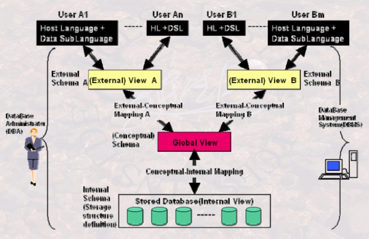

# 数据库系统的标准结构
## DBMS管理数据的三个层次
1. 外部(External)层次=用户层次: 某一用户能看到与处理的数据,全局数据中的一部分
2. 全局层次=逻辑/概念(Conceptual)层次: 从全局角度理解/管理的数据,含相应关联的约束
3. 内部(Internal)层次=物理层次: 存储在介质上的数据,含存储路径,存储方式,索引方式等.

### 数据与模式
* 表格中展现的数据--视图(View): 某一表现形式下表现出来的数据库中的数据
* 数据的结构--模式(Schema): 对数据库中的数据进行的一种结构性描述,所观察到数据的结构信息

> 单纯讨论模式,则默认为全局模式;
单纯讨论视图,则默认为外视图.

## 三级模式
* 外模式/子模式/用户模式: 某一用户能够看到与处理的结构描述
* 概念模式/全局模式/逻辑模式: 从全局角度理解/管理的数据的结构描述,含相应的关联约束
* 内模式: 存在介质上的数据的结构描述,含存储路径,存储方式,索引方式等.

## 两层映像
* E-C Mapping: 将外模式映射为概念模式,便于用户观察使用
* C-I Mapping: 将概念模式映射为内模式,便于计算机存储处理

## 两个独立性
* 逻辑数据独立性: 当概念模式变化时,可以不改变外部模式(只改E-C映像),从而无需改变应用程序
* 物理数据独立性: 当内部模式变化时,可以不改变概念模式(只改C-I映像),从而不改变外部模式

# 数据模型
## 数据模型,模式,数据 的关系
### 数据模型
* 规定模式统一描述方式的模型.三要素包括:数据结构,操作和约束
* **数据模型**是对**模式**本身的抽象,**模式**是对**数据本身**结构形式的抽象
> 关系模型是一种数据模型,遵循关系模型的不同的表称为模式,表的具体内容称为数据

### 三大经典数据模型
* 关系模型:表
* 层次模型:树,包括记录及记录之间的指针
* 网状模型:图

# 数据库系统的演变与发展
## 从文件系统到数据库
* 文件系统: 数据存取以记录为单位,不用考虑文件存储的物理细节,摆脱对物理设备存取的复杂负担;不足之处是数据与程序紧密结合,数据的组织依赖处理文件的应用程序.
* 数据库系统: 由DBMS管理,较强地独立于应用程序.数据存取以记录/数据项/记录集合为单位;统一的数据控制功能,共享度高;冗余小,便于查询.

## 从层次模型数据库,网状模型数据库到关系数据库(第一代到第二代)
* 层次模型与网状模型
    * 数据之间关联由用户建立的复杂的指针系统来维系,结构复杂
    * 数据检索依赖由指针系统指示的路径
    * 逐一记录的操作,不能有效支持记录集合的操作
* 关系模型数据库
    * 关系由Table的属性来表征,结构简单
    * 数据检索不依赖于路径信息或过程信息,支持非过程化的数据操作.
    * 有效支持记录集合的操作
    * 较为完善的理论基础
    * 消除了用户建立的指针系统

## 由关系数据库到对象关系数据库,面向对象数据库
* 关系数据库
    * 按行按列形式组织数据: 关系的1范式
    * 数据不可再分
    * 关系运算: 关系代数,元组演算,域演算 -> 标准SQL
    * 关系设计理论
* 对象-关系数据库
    * 可有效支持不满足关系第1范式的数据项
    * 以对象来封装需分解的数据项
    * 行对象与列对象:聚集对象与结构对象
* 面向对象数据库
    * 面向对象技术与集合/聚集操作技术(SQL)的结合
    * 复杂的数据类型
    * 支持面向对象的特征
* XML数据库
    * 是数据库的另一种形式,被称为半结构化数据库
    * 数据与数据的语义合并在一起存储和处理
    * 面向数据交换而提出,在互联网世界得到应用.

## 由多种数据库到多数据库开放式互联
* 应用程序之间使用开放数据互联接口(Open DataBase Connection)
* ODBC针对不同数据库来进行不同操作

## 先进的新型数据库