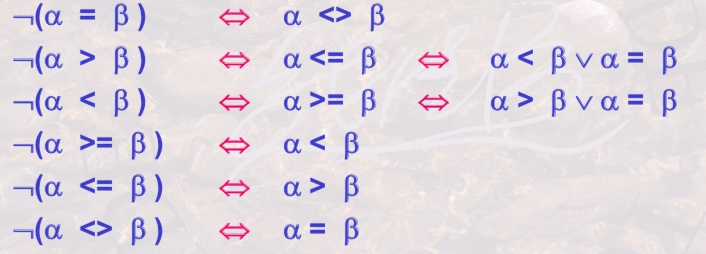

# 关系元组演算
* 关系演算是以数理逻辑中的谓词演算为基础的
* 关系演算是描述关系运算的另一种思维方式
* SQL语言是继承了关系代数和关系演算各自的优点所形成的
* 按照谓词变量的不同，可分为**关系元组演算**和**关系域演算** 
    * 关系元组演算是以元组变量作为谓词变量的基本对象
    * 关系域演算是以域变量作为谓词变量的基本对象

## 元组演算公式的基本形式
> 基本形式: {t|P(t)}

* 上式表示所有使谓词P为真的元组t的集合
    * t是元组变量
    * t∈r 表示元组t在关系r中
    * t[A]表示元组t的分量,即t在属性A上的值
    * P是与谓词逻辑相似的公式,P(t)表示以元组t为变量的公式

## 关系元组演算公式的完整定义
* 三种形式的原子公式是公式
    * s∈R : t是关系R中的一个元组,`例如{t|t∈Student}`
    * s[A]θc : 元组分量s[A]与常量C之间满足比较关系θ
    * s[A]θu[B] : s[A]与u[B]为元组分量,A和B分别是某些关系的属性,他们之间满足比较关系θ
* 如果P是公式,则¬P也是公式
* 如果P1,P2是公式,则P1⋀P2, P1⋁P2也是公式
* 如果P(t)是公式，R是关系，则∃(t∈R)(P(t))和∀(t属于R)(P(t)) 也是公式
* 上述运算符的优先次序自高至低为:括弧;θ ;∃ ;∀ ;¬ ;⋀ ;⋁ ;

# 关系元组演算公式
* 存在∃,任意∀
* 如果F是一个公式,则∃(t∈r)(F(t))也是公式
* 如果F是一个公式,则∀(t∈r)(F(t))也是公式
* 被存在或任意限定的元组变量t,则该变量被称为"约束变量",否则为自由变量

# 等价变换

# 关系域演算
* 关系域演算基本形式: {<x1,s2,...,xn>|P(x1,s2,...,xn)}, 其中xi代表域变量或常量,P为以xi为变量的公式

## 元组演算与域演算的比较
* 元组演算是以元组为变量，以元组为基本处理单位，先找到元组，然后再找到元组分量，进行谓词判断
* 域演算是以域变量为基本处理单位，先有域变量，然后再判断由这些域变量组成的元组是否存在或是否满足谓词判断。
* 元组演算和域演算可以等价互换

# 基于关系域演算的QBE语言
## 域演算语言QBE
* 特点:操作独特，基于屏幕表格的查询语言，不用书写复杂的公式，只需将条件填在表格中即可.
* 是一种高度非过程化的查询语言
* 特别适合终端用户使用

## QBE的基本形式
* 关系名区: 用于书写欲待查询的关系名
* 属性名区: 用于显示对应关系名区关系的所有属性名
* 操作命令区: 用于书写查询操作的命令
* 查询条件区: 用于书写查询条件

## QBE的操作命令
* 显示输出操作: Print 或 P.
* 删除操作: Delete或D
* 插入操作: Insert或I
* 更新操作: Update或U

## QBE的查询条件
* QBE查询条件可以直接在查询条件区中书写,形式为θ参量
* 条件θ参量中的参量也可以是域变量,用任何一个值带有下划线表示,被称为示例元素.示例元素下划线上面的值不起作用，被当作域变量名称来对待，只用于占位或是连接条件。不带下划线的则是构成实际条件一部分的值。

# 关系演算的安全性
* 不产生无限关系和无穷验证的运算被称为是安全的
* 关系代数是一种集合运算,集合本身是有限的,有限元素集合的有限次运算仍旧是有限的,因此是安全的
* 关系演算不一定是安全的
    > 例如"假验证",即验证所有元素是否都使ω(u)为false
    > 例如"真验证",即验证所有元素是否都使ω(u)为true
* 因此需要对关系演算施加约束条件,即任何公式都在一个集合范围内操作,而不是有限范围内操作,才能保证其安全性.

### 安全约束有限集合DOM
* DOM(φ)是一个有限集合,其中的每个符号要么是φ中明显出现的符号,要么是在φ中的某个关系R的某元组的分量
* DOM主要用于约束φ中一些谓词的计算范围,它不必是最小集合.

## 安全元组演算表达式需要满足以下三个条件,{t|φ(t)}为安全表达式
* 只要t满足φ,t的每个分量就是DOM(φ)的一个成员
* 对于φ中形如(∃u)(ω(u))的子表达式,若u满足ω,则u的每个分量都是DOM(ω)中的成员.
* 对于φ中形如(∀u)(ω(u))的子表达式,若u不满足ω,则u的每个分量都是DOM(ω)中的成员.

# 关系运算的一些观点
* 关系运算有三种:关系代数 关系元组演算和关系域演算
* 关系代数是以集合为对象的操作思维,由集合到集合的变换
* 元组演算是以元组为对象的操作思维，取出关系的每一个元组进行验证，有一个元组变量则可能需要一个循环，多个元组变量则需要多个循环
* 域演算是以域变量为对象的操作思维，取出域的每一个变量进行验证看其是否满足条件
* 三种运算之间是等价的
* 三种关系都是非过程性的,相比之下域演算的非过程性最好，元组演算次之，关系代数最差.