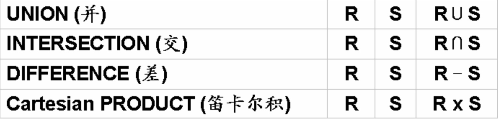
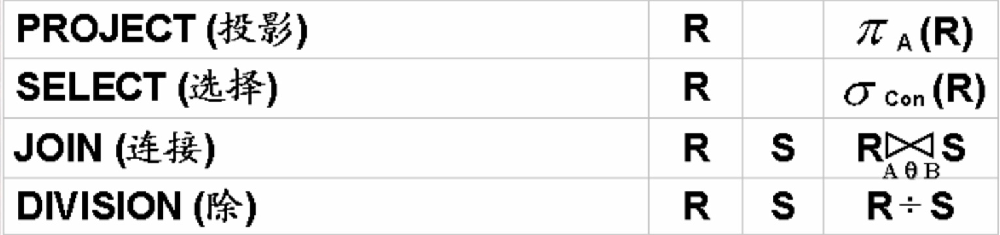

并(∪),差(-),乘积(×),选择(σ),投影(π),交(∩),连接(⨝),除(÷)

# 关系代数概述
* 基于集合,提供了一系列的关系代数操作:并、差、笛卡尔积(广义积)、 选择、投影和更名等基本操作
* 以及交、 连接和关系除等扩展操作，是一种集合思维的操作语言。
* 关系代数操作以一个或多个关系为输入，结果是一个新的关系。
* 用对关系的运算来表达查询，需要指明所用操作, 具有一定的过程性。
* 是一种抽象的语言，是学习其他数据库语言，如SQL等的基础

## 集合操作

## 纯关系操作

# 并相容性
* 参与运算的两个关系及其相关属性之间有一定的对应性、可比性或意义关联性
* 并,差,交需要满足
* 定义: 关系R与关系S存在相容性，当且仅当:
    1. 关系R和关系S的属性数目必须相同;
    2. 对于任意i，关系R的第i个属性的域必须和关系S的第i个属性的域相同(属性名称不同也没关系)

# 并操作
* 定义: 假设关系R和关系S是**并相容**的，则关系R与关系S的并运算结果也是一个关系，记作:R∪S, 它由或者出现在关系R中，或者出现在S中的元组构成。
* 在合并时去掉重复元组

# 差运算
* 假设关系R 和关系S是**并相容**的，则关系R与关系S的差运算结果也是一个关系，记作:R - S, 它由**出现在关系R**中但**不出现在关系S**中的元组构成。

# 广义笛卡尔积
* 关系R (<a1 , a2, ..., an >) 与关系S(<b1, b2, ..., bm >) 的广义笛卡尔积 (简称广义积,或 积 或笛卡尔积) 运算结果也是一个关系，记作: R x S, 它由 关系R中的元组与关系S的元组进行所有可能的拼接(或串接)构成。
* 当检索多个表时,则可以将这些表串接起来,然后检索.

# 选择
* 给定一个关系R, 同时给定一个选择的条件condition(简记con), 选 择运算结果也是一个关系,记作σcon(R),它从关系R中选择出满足给定条件condition的元组构成。
* 条件con由逻辑运算符连接比较表达式组成
* 逻辑运算符 and or not
* 比较表达式 大于小于等于不等于

# 投影
* 给定一个关系R, 投影运算结果也是一个关系，记作πA(R) , 它从 关系R中选出属性包含在A中的列构成。

# 交
* 假设关系R和关系S是并相容的,则关系R与关系S的交运算也是一个关系,记为R∩S
* R∩S=R-(R-S)

# 连接操作
## θ-连接
* 投影与选择操作对单个表操作,而θ连接操作可以进行多个表操作.
* 定义:给定关系R和关系S, R与S的θ连接运算结果也是一个关系， ，它由关系R和关系S的笛卡尔积中, 选取R中属性A与S中属性 B之间满足θ 条件的元组构成。

## 等值连接
* 当θ-连接中运算符为“=”时，就是等值连接.

## 自然连接
* 给定关系R和关系S, R与S的自然连接运算结果也是一个关系，记作 R⨝S，它由关系R和关系S的笛卡尔积中选取相同属性组B上值相等的元组所构成。
* 自然连接是一种特殊的等值连接
* 要求关系R和关系S必须有相同的属性组B(如R,S共有一个属性B1,则B 是B1 , 如R, S共有一组属性B1, B2,  , Bn，则B是这些共有的所有属性)

# 关系的除运算
* 触发运算用于求解"查询...全部的..."问题
* 前提条件:给定关系R(A1 ,A2 ,   ,An)为n度关系，关系S(B1 ,B2 ,  ,Bm)为m 度关系 。如果可以进行关系R与关系S的除运算，当且仅当:属性集{B1 ,B2, ,Bm}是属性集{A1 ,A2, ,An}的真子集，即m<n。
* 关系R 和关系S的除运算结果也是一个关系，记作R  S，分两部 分来定义。
* 设属性集{C1,C2,   ,Ck } = {A1,A2,   ,An } – {B1,B2,   ,Bm }, 则有k=n–m 则RS结果关系是一k度(n-m度)关系，由{C1,C2,   ,Ck }属性构成

# 外链接操作
* 定义:两个关系R与S进行连接时，如果关系R(或S)中的元组在S(或R)中找
不到相匹配的元组，则为了避免该元组信息丢失，从而将该元组与S(或R)中
假定存在的全为空值的元组形成连接，放置在结果关系中，这种连接称之为 外连接(Outer Join)。