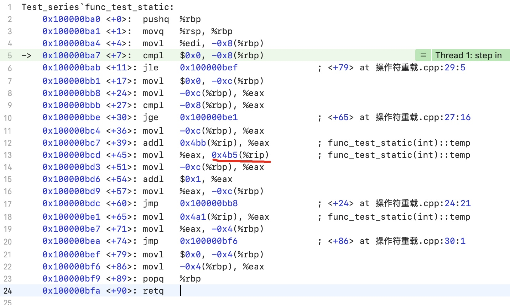
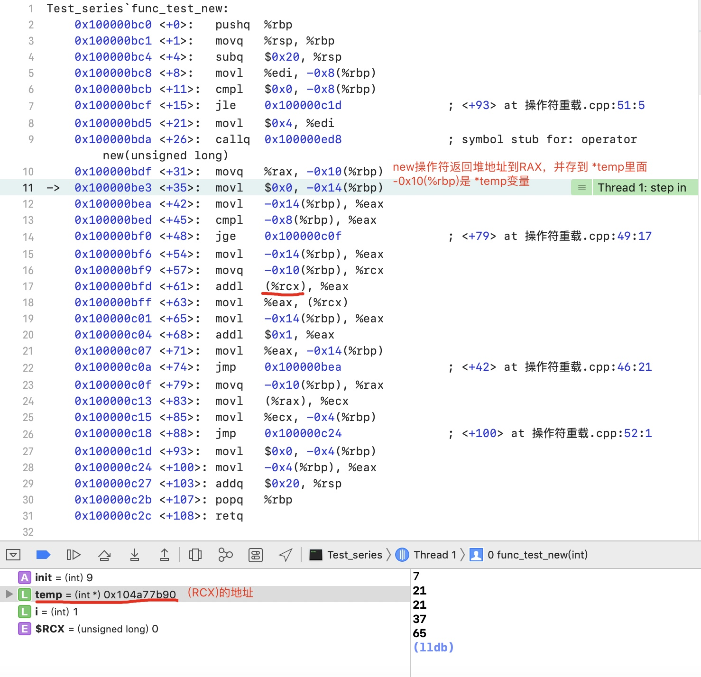

###基本类型
* `wchar_t` 长度为16bit，用来存储拓展长度的字符；
* `char16_t` 与 `char32_t` 用来存储16bit与32bit长度的Unicode编码。

* `char`类型与`signed char`类型不同。
* 在使用`char`类型时，必须要规定它是`signed char` 还是 `unsigned char`。不能只用`char`。

* 如果要用到比`int`大的数字，则使用`long long`来表示，因为`int` 一般与`long`的长度相等。

* 在使用内置数据类型（例如`string`或者`vector<T>`）时，使用`string::size_type`及`vector<T>::size_type`来表示相应数据类型的大小。
  * 好处是不会溢出。
  * 内部实现是使用`typedef`常用数据类型。


###类型转换
* 如果将一个溢出值赋予给一个有符号类型，结果将会报错。
* 有符号数与无符号数相加，有符号数以无符号数读取（如果为负数则读取出错误的值）

###立即数(Literals)
* 正常书写的数字为int型。20==024==0x14
* 可以通过给立即数增加前缀或后缀来确定一个立即数的类型。
* 小数默认为double型


* `string`是`char`型的列表，并在末尾增加了`\0`。但是`strlen()`返回的仍然是不加`\0`的个数。

###变量
* 在函数中，新定义的内建类型是没有初始化的。这种情况下不能访问它。
* 初始化类对象时，由类来决定初始的值。但是尽量手动初始化所有内建类型的变量。
* 使用`extern`可以声明但不定义变量。(`extern int i;`)

###C++ 关键字


* 系统保留的标识符(Identifier)包括连续两个下划线、下划线后接大写字母、函数外定义的变量不能由下划线开头。

####命名习惯
* 变量名通常是小写字母。
* 类名通常是大写字母开头。
* 变量名由多个单词组成的时候用下划线分隔。

####作用域
* 在任何括号之外的域为全局的。
* 为了更高可读性，应该在第一次使用的时候定义变量，而不是在开头定义。
* 在变量`a`为全局变量的情况下，某个代码块中还可以声明局部变量`a`。
    * 代码块内，在声明局部变量之前，访问的`a`是全局变量。
    * 声明局部变量之后，访问`a`则为局部变量。
    * 声明局部变量之后，可以使用`::a`来访问全局变量，全局标识符没有名字，所以留空。

###复合类型
####引用
* 声明一个引用时必须初始化。
* 在绑定了一个变量的引用之后，不能再绑定别的变量。
* 引用不是对象，而是一个对象的另一个名称。
* 一个变量可以有多个引用。

####指针
* 指针指向其他类型的变量。
* 声明null指针,以下三个等价：
    * `int *p1 = nullptr`
    * `int *p1 = NULL`
    * `int *p1 = 0`
* 不能用整型等变量类型给指针的地址赋值。
* `void*`是指向了一个具体的地址，但是没有定义类型，因此它可以指向各种类型的对象。

####const修饰词
* const在创建的时候必须初始化，并且之后不能改变。
* 在使用立即数对const变量进行赋值时，会直接将变量名变为立即数。
* 要想在多个源文件中只创建一个const，则需要用`extern`来定义。
* 如果用`const`指针或引用对一个普通变量进行操作，那么它们无法改变这个变量。
* `const reference`是const变量的引用，但可以引用int等变量。
* `const`分为高级与低级
    * `int *const p1 = &i;` 等价于 `constexpr int *q = nullptr` 高级：指针本身是const的
    * `const int *p2 = const int c1 = 2;` 低级：指针指向的变量是const的。

####constexpr修饰词
* 在初始化一个const类型时，有时不确定初始化的表达式是否为常量，则可以用`constexpr`来限定初始化表达式**必须**为常量。目的是为了让编译器检查赋值语句等号右边的变量是const的。
* `const`类型可以用变量来进行初始化。

###变量类型操作
####类型别名
* `typedef double wages;`表示可以使用`wages`代替`double`。
* `using SI = Sales_item;`表示可以用`SI`表示“`Sales_item`类型”。
* `typedef char *pstring;`意思是`pstring`表示`char*`。

####auto
* 使用`auto`必须初始化变量，其类型由初始化表达式决定。
* 在对auto类型变量进行初始化时，有时会与原类型不同
    * 使用引用类型进行初始化时，此变量会被初始化成被引用的变量类型。而引用可以这样写 `auto &g = x;`
    * auto会忽略top-level的`const`而保留low-level的`const`。而top-level的变量可以这样写 `const auto f = x;`

####decltype类型
如果我们需要提取一个表达式的类型，而不需要一个表达式的具体值的时候，可以使用`decltype`。
* `decltype(f()) sum = x;`是基本的使用方法。这里编译器只会判断函数f的返回值，而不执行f。
* `decltype`可以根据初始化时的类型，来对被初始化的变量类型进行调整。

* 如果一个变量不加任何括号，则使用变量内容的类型；如果一个变量加括号，则将这个变量当做一个表达式，使用这个表达式本身的类型。


###自定义数据结构
####结构体
建议用下面第一种方式定义结构体变量，下面两种方式等价。
注意结构体后面的分号！

```c
// method 1
struct Sales_data {
    /*....*/
} accum, trans, *salesptr;

// method 2
struct Sales_data {
    /*....*/
};
Sales_data accum, trans, *salesptr;
```

####自定义头文件
预处理程序从C继承，在编译之前运行，用来替换源代码中的头文件等内容。为了防止一个头文件被多次包含，预处理程序定义了`header guards`来根据预处理程序变量来判断。预处理程序变量包含两个状态：定义和没定义。
`#define`命令后面跟一个名称，作为一个预处理变量。
* `#ifdef`返回真表示已经被定义过。
* `#ifndef`返回真表示还没被定义过。
* 如果上面的命令返回真，则顺序执行，直到`#endif`。

正常的栗子如下：

```c
#ifndef SALES_DATA_H 
#define SALES_DATA_H 
#include <string> 
struct Sales_data {
    std::string bookNo; 
    unsigned units_sold = 0; 
    double revenue = 0.0;
}; 
#endif
```

* 预处理变量名不遵守作用域规则。所以变量名必须在整个程序中是独一无二的。在习惯上我们通常将它全部大写。
* 在实际项目中，强烈推荐每个头文件都带有`header guards`，即使只有一个头文件。

###static的局部变量
对于一个函数里面的static局部变量，变量存储在代码段。非static的局部变量存储在堆栈段。


* 下图是带`static`变量的结果
```
int func_test_static(int init){
    if(init > 0){
        static int temp = 9;
        for(int i=0;i<init;i++){
            temp += i;
        }
        return temp;
    }
    return 0;
}
```


* 下图是不带`static`变量的结果

```
int func_test(int init){
    if(init > 0){
        int temp = 0;
        for(int i=0;i<init;i++){
            temp += i;
        }
        return temp;
    }
    return 0;
}
```


* 下图是使用`new`操作符存放变量的结果

```
int func_test_new(int init){
    if(init > 0){
        int* temp = new int;
        for(int i=0;i<init;i++){
            (*temp) += i;
        }
        return *temp;
    }
    return 0;
}
```
